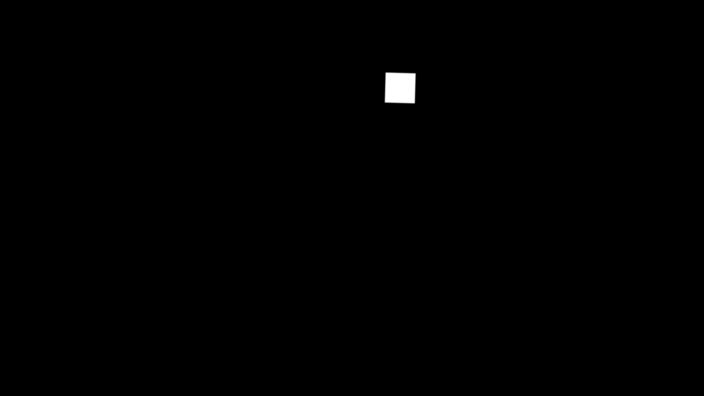

# DeepFakeDetection Dataset

Please see the [original blog post of the authors]() for more information.

## Example Video

## Masks
In comparison to the FaceForensics++ dataset, the DeepFakeDetection manipulated videos masks are directly extracted after the manipulation.

