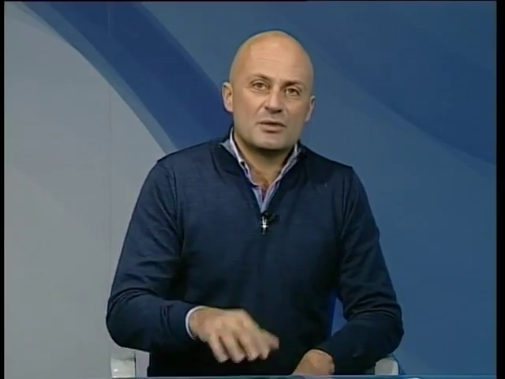

# NeuralTextures Manipulation

NeuralTextures videos are manipulated by using the face model by Face2Face to track and render corresponding UV masks. Those masks are then fed into an encoder decoder architecture which is optimized using Neural Textures. See [the appendix](https://arxiv.org/pdf/1901.08971.pdf) as well as [the original paper](https://arxiv.org/pdf/1904.12356.pdf) for more implementation details.  

## Example Video

## Disclaimer about Reenactment Quality

We manipulated every video in our dataset multiple times and chose the best visual result for our dataset. This was needed, as we trained our network using a generative adversarial loss which sometimes corrupted the training und the output process. By heart, NeuralTextures will reenact face motions of an input video to a target video, though by using this adversarial approach it can happen that the reenactment will not be precise. As we only evaluated for visual quality, those instances can happen but visual quality is the more important factor for our main detection task. 

## Masks
In comparison to FaceSwap or Face2Face, it is not straightforward what to select as the NeuralTextures manipulated area. Mainly, we manipulate the region below the mouth though we feed a region that is a 1.7 scaled quadratic region around the Face2Face mask. The network can introduce noise in that area but that necessarily. We provide the used Face2Face masks for now, but will include the uv masks as well in the near future.
 
   