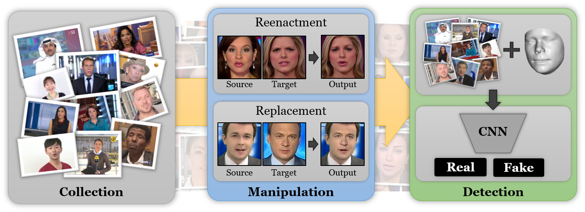

# Dataset



If you would like to download the FaceForensics++ data, please fill out [this google form](https://docs.google.com/forms/d/e/1FAIpQLSdRRR3L5zAv6tQ_CKxmK4W96tAab_pfBu2EKAgQbeDVhmXagg/viewform) and, once accepted, we will send you the link to our download script.. You will get a link to the download script which will be used throughout this text to obtain the full dataset. This includes 977 downloaded videos from youtube, 1000 original extracted sequences that contain a unobstructed face that can be easily tracked, as well as their manipulated versions using our three methods: Deepfakes, Face2Face and FaceSwap. We also provide all Deepfakes models.

There are two ways to get the dataset: you can use the script to download all images or videos or generate most of the data on your own using the scripts provided in this folder which saves quite a bit of bandwidth if you are interested in the raw image material. However, you will have to download the Face2Face manipulated videos/images as there is no publicly available implementation to generate them from scratch. 

The dataset has the following folder structure which will either be produced by the download or generation scripts.

```shell
FaceForensics++ dataset
|-- downloaded_videos
    < contains all original downloaded videos, video information files and their extracted sequences
      which can be used to extract the original sequences used in the dataset >
|-- original_sequences
    < original sequence images/videos/compressed>
|-- manipulated_sequenecs
    |-- Deepfakes
    < Deepfake sequence images/videos/compressed as well as models and masks after poisson image editing>
    |-- Face2Face
    < Face2Face sequence images/videos/compressed as well as masks >
    |-- FaceSwap
    < FaceSwap sequence images/videos/compressed as well as masks >
```

We renamed all original sequences to integers between `0` and `999`. The original youtube id's can be recovered using `conversion_dict.json`.

Here is a overview of the space required to save/download the dataset:

- Downladed videos: 38.5GB
- All h264 compressed videos with compression rate factor
    - 0: ~200GB
    - 23: ~8GB
    - 40: ~1GB
- All raw extracted images: 1.5TB

## 1. Download script

### General usage
Please consult

`python download-FaceForensicspp.py -h`

for a detailed overview of the download scrips parameter choices and their respective defaults. The general usage is as follows:

```shell
python download-FaceForensicspp.py
    <output path>
    -d <dataset type, e.g., Face2Face, original or all>
    -c <compression quality, e.g., c23 or raw>
    -t <file type, e.g., images, videos, masks or models>
```

Generally we advise you to download the compressed videos and extract the frames on your own as the raw file sizes are quite large. If you are interested in the raw material, you might consider generating them by yourself as outlined below.

### Examples
In order to download all light compressed (i.e., a visually lossless compression rate factor of 23 using the h264 codec) original as well as altered videos of all three manipulation methods use

`python download-Faceforensicspp.py <output path> -d all -c c23 -t videos`

For all lossless compressed (i.e., a compression rate factor of 0) extracted original images run

`python download-FaceForensicspp.py <output path> -d original -c c0 -t images`

You can also download a random selection of images for each video which shortens and specify a seed for reproduction. For example, for 10 random raw Face2Face images call

`python download-FaceForensicspp.py <output path> -d Face2Face -c raw -t images--num_images 10 --seed <integer>`

and with

`python download-FaceForensicspp.py <output path> -d Face2Face -c raw -t masks --num_images 10 --seed <integer>`

you obtain the corresponding masks of the chosen method, i.e., a binary mask indicating the manipulated pixels.

### Original Videos

You can download the original videos that were downloaded from youtube using

`python download-FaceForensicspp.py <output path> -d original_youtube_videos`

The zipped file contains all downloaded videos in their original length as well as a json file containing the frames that were extracted for our dataset. Note: we only downloaded the source video without audio. However, you can re-download and extract the audio using the frame numbers.

### Frame Extraction

If you decided to download the compressed videos, you easily extract the images frames with either `ffmpeg` or `opencv`. You can use

`python extracted_compressed_videos.py <output path> -d <"all" or single dataset via "Face2Face" or "original"> -c c0`

## 2. Dataset generation

For DeepFakes and FaceSwap see the respective directories. As Face2Face is not publicly available, you have to download those videos yourself and extract the frames. 

## 3. File splits

Our used dataset file splits can be found in the [respective folder](splits). We used 720 videos for train and 140 videos for validation as well as testing.

# Requirements

General
- python3
- [tqdm](https://github.com/tqdm/tqdm) (install via pip install tqdm)

For compression/extraction
- [ffmpeg built with h264](https://trac.ffmpeg.org/wiki/CompilationGuide/Ubuntu)
- opencv (install via  pip install opencv-python)

